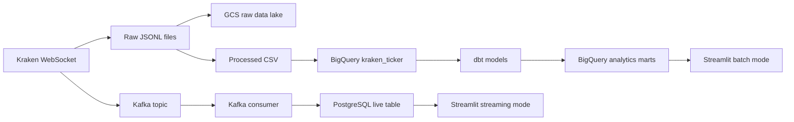

# Crypto Market Data Pipeline

This project builds a small end-to-end data engineering pipeline for Kraken
cryptocurrency ticker data. It supports both a batch analytics path and a live
streaming path, then serves the data through a Streamlit dashboard.

The project uses public Kraken WebSocket ticker messages for `BTC/USD`,
`ETH/USD`, and `SOL/USD`.

## Architecture



## Tech Stack

- **Python**: ingestion, transformation, loading, and streaming workers
- **Kraken WebSocket API**: ticker data source
- **Kafka**: streaming message broker
- **PostgreSQL**: live serving database for streaming dashboard mode
- **GCS**: raw JSONL data lake
- **BigQuery**: analytics warehouse
- **dbt**: BigQuery analytics models and tests
- **Terraform**: GCS and BigQuery infrastructure
- **Streamlit**: dashboard
- **Docker Compose**: local PostgreSQL and Kafka services

## Data Model

The core ticker table contains:

```text
symbol
event_type
last_price
volume
vwap
low_price
high_price
change
change_pct
event_timestamp
```

dbt builds analytics models on top of the BigQuery table:

- `latest_price_per_symbol`
- `price_history`
- `hourly_price_summary`
- `message_count_per_symbol`

## Setup

Create the virtual environment and install dependencies:

```bash
python3 -m venv .venv
.venv/bin/python -m pip install -r requirements.txt
```

Start the local services:

```bash
docker compose up -d
```

## Cloud Infrastructure

Terraform provisions:

- one GCS bucket for raw Kraken JSONL files
- one BigQuery dataset
- one BigQuery table for clean Kraken ticker records

Create a local Terraform variables file:

```bash
cp infra/terraform/terraform.tfvars.example infra/terraform/terraform.tfvars
```

Edit `infra/terraform/terraform.tfvars`:

```hcl
project_id          = "your-gcp-project-id"
raw_bucket_name     = "your-unique-raw-bucket-name"
region              = "us-central1"
location            = "US"
bigquery_dataset_id = "crypto_analytics"
```

Apply the infrastructure:

```bash
cd infra/terraform
terraform init
terraform plan
terraform apply
```

## Batch Analytics Pipeline

Collect raw Kraken ticker messages as JSONL:

```bash
.venv/bin/python src/ingestion/ingest_kraken_ticker_raw.py \
  --symbols BTC/USD ETH/USD SOL/USD
```

Transform the latest raw JSONL file into CSV:

```bash
.venv/bin/python src/transform/kraken_ticker_to_csv.py
```

Run data quality checks:

```bash
.venv/bin/python src/quality/check_kraken_ticker_csv.py \
  --input data/processed/kraken_ticker/<processed-file>.csv
```

Upload raw JSONL files to GCS:

```bash
.venv/bin/python src/load/upload_raw_kraken_jsonl_to_gcs.py \
  --bucket crypto-dashboard
```

Load the latest processed CSV into BigQuery:

```bash
.venv/bin/python src/load/load_kraken_ticker_csv_to_bigquery.py
```

For a clean development reload, replace the BigQuery table contents:

```bash
.venv/bin/python src/load/load_kraken_ticker_csv_to_bigquery.py --replace
```

Run dbt transformations and tests:

```bash
export BIGQUERY_PROJECT_ID=dido-486313
.venv/bin/dbt debug --profiles-dir dbt
.venv/bin/dbt run --profiles-dir dbt
.venv/bin/dbt test --profiles-dir dbt
```

## Streaming Pipeline

The streaming path reads Kraken WebSocket messages, publishes them to Kafka,
loads them into PostgreSQL, and refreshes the dashboard from PostgreSQL.

Run the full streaming demo:

```bash
./scripts/run_streaming_pipeline.sh
```

Run it with custom symbols:

```bash
./scripts/run_streaming_pipeline.sh BTC/USD ETH/USD SOL/USD
```

The helper starts PostgreSQL, Kafka, the Kafka producer, the PostgreSQL
consumer, and the Streamlit dashboard. Press `Ctrl+C` in that terminal to stop
the helper worker processes.

To run the streaming pieces manually, use separate terminals:

```bash
.venv/bin/python src/streaming/consume_kraken_ticker_to_postgres.py
```

```bash
.venv/bin/python src/ingestion/produce_kraken_ticker_to_kafka.py \
  --symbols BTC/USD ETH/USD SOL/USD
```

```bash
DASHBOARD_SOURCE=postgres .venv/bin/streamlit run dashboard/app.py
```

## Dashboard

Start the dashboard in streaming mode:

```bash
DASHBOARD_SOURCE=postgres .venv/bin/streamlit run dashboard/app.py
```

Start the dashboard in batch analytics mode:

```bash
DASHBOARD_SOURCE=bigquery .venv/bin/streamlit run dashboard/app.py
```

Dashboard modes:

- **Streaming mode** reads the live PostgreSQL table populated by the Kafka
  consumer.
- **Batch mode** reads dbt mart tables in BigQuery.

The dashboard shows:

- selected symbol count
- latest event timestamp
- latest price cards
- recent ticker records
- records by symbol bar chart
- price history line chart

## Project Structure

```text
dashboard/
  app.py

dbt/
  profiles.yml

infra/terraform/
  main.tf
  variables.tf
  outputs.tf
  terraform.tfvars.example

models/
  staging/
  marts/

scripts/
  run_streaming_pipeline.sh

sql/
  postgres/
    create_tables.sql

src/
  ingestion/
  load/
  quality/
  streaming/
  transform/
```
